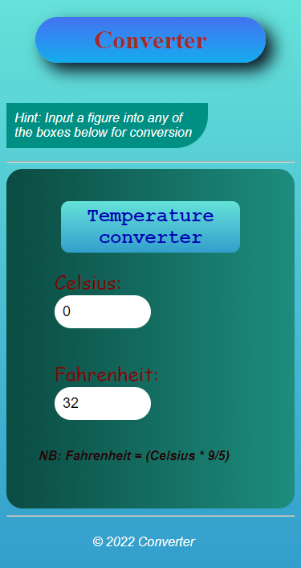
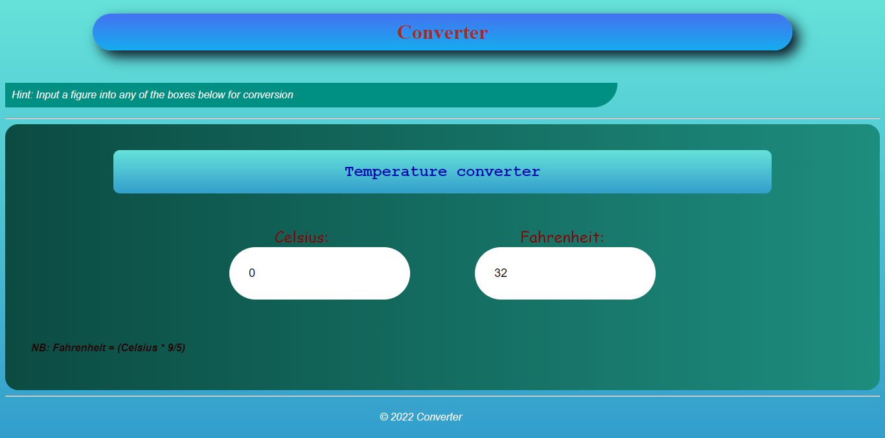

# Temperature Converter App Project

## Table of contents

- [Overview](#overview)
  - [The challenge](#the-challenge)
  - [Screenshot](#screenshot)
  - [Links](#links)
- [My process](#my-process)
  - [Built with](#built-with)
- [Author](#author)

## Overview

### The challenge

Users should be able to:

- Convert from Celsius to fahrenhrit using any of the input columns
- Site should be scalable across various devices

### Screenshot

### Links

- Live site URL: [converterapp](http://converterapps.netlify.app)

## My process

### Built with

- Semantic HTML5 markup
- CSS custom properties
- Flexbox
- Mobile-first workflow

## Author

- Twitter - [Abiye Iniabere](https://www.twitter.com/Victor_Abiye)
